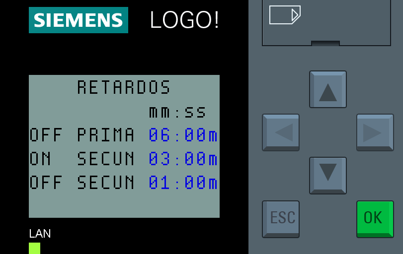

# Manual Logo 8 de Siemens mediante pantalla integrada

## Introducción

El PLC Logo 8 de Siemens es un controlador lógico programable compacto y versátil que se utiliza en diversas aplicaciones de automatización. Este manual describe cómo utilizar la pantalla integrada del PLC para configurar y monitorear el dispositivo.

## Contenidos

1. [Navegación Básica en la Pantalla](#1-navegación-básica-en-la-pantalla)
2. [Encendido y Acceso Inicial](#2-encendido-y-acceso-inicial)
3. [Configuración del Sistema](#3-configuración-del-sistema)
4. [Monitoreo de Entradas y Salidas](#4-monitoreo-de-entradas-y-salidas)
5. [Modificación de Parámetros](#5-modificación-de-parámetros)
6. [Mensajes de Alerta y Diagnóstico](#6-mensajes-de-alerta-y-diagnóstico)
7. [Mantenimiento y Solución de Problemas](#7-mantenimiento-y-solución-de-problemas)

<!-- 

 -->

## 1. Navegación Básica en la Pantalla

### 1.1 Botones de Navegación

- **Flechas**: Utilice las flechas arriba, abajo, izquierda y derecha para navegar por las opciones del menú.
- **Enter (OK)**: Selecciona la opción resaltada.
- **Escape (ESC)**: Regresa al menú anterior o cancela la operación actual.

### 1.2 Pantallas ARC

1. Si su aplicacion ha sido programada por ARC puede desplazarse por diferentes pantallas informativas utilizando las flechas direccionales arriba y abajo

2. El orden en el que se mostraran las pantallas es este:
    - Entradas
    - Salidas
    - Consignas
    - Otros parametros
    - Horarios
    - Programa en RUN

3. La ultima pantalla "Programa en RUN", es generada por el sistema. Desplazando con las teclas derecha e izquierda se puede mostrar:
- la hora y la fecha actual (1 pantalla)  

- estado de entradas, salidas y marcas, analogicas y digitales (9 pantallas)  

4. Desde la pantalla "Programa en RUN" se puede acceder al menu principal pulsando la tecla `ESC`  

## 2. Ajuste de consignas y horarios

### 2.1 Ajuste de Consignas

1. Situarse en la pantalla donde se encuentra el valor que se desea modificar.  
2. Hay pantallas que solo tienen valores de lectura como la de salidas:  

3. En caso de la pantalla de consignas los valores marcados aqui en azul (en la pantalla no se ve en colores) si son modificables.  

4. Mantener el `ESC` pulsado para entrar en **modo modificacion** hasta que se resalte uno de los valores modificables.  
5. Con las fechas arriba y abajo seleccionar cual de los valores se quiere modificar.  
6. Una vez seleccionado presionar ok para entra a modificar el valor.
7. Con las flechas izquierda y derecha desplazarse digito a digito y modificar cada digito con las flechas arriba y abajo.
8. Una vez terminado de modificar presionar `OK` para aceptar el valor o `ESC` para cancelar
9. Por ultimo, salir del modo modificacion presionando brevemente `ESC`.

### 2.2 Ajuste de Horarios

1. Situarse en la pantalla donde se encuentra el horario que se desea modificar.  
2. Cara horario dispone de dos periodos semanales con un arranque y un paro:  

4. La primera linea indica los dias que el horario esta activo de lunes a domingo con la inicial del dia en ingles si esta activo, o un guion si no esta activo
5. La Segunda y tercera lineas indican la hora de arranque y de parada.
6. La ultima linea puede tener un selector para mantener el horario activado 24h. independientemente de la programacion.

3. El proceso para el ajuste es el mismo procedimiento que en el ajuste de consignas: entrar en **modo modificacion** manteniendo `ESC`, seleccionar el valor a modificar,...

## 6. Alarmas

### 6.1 Mensajes de alarma

1. En caso de producirse una alarma aparecera una nueva pantalla con la informacion de la alarma y la fecha y la hora a la que se ha producido.
2. Con las flachas de direccion arriba y abajo podremos seguir navegando a las pantallas normales.
3. Las pantallas con la informacion de la alarma seran las primeras en el orden de pantallas anteriormente mencionado.

### 6.2 Reset de alarma

1. En caso de que la alrma haya sido solventada, en caso de no desaparecer sola, la propia pantalla de alarma dispondra de un parametro llamado reset con valor `off`.
2. Siguiendo el mismo procedimiento que en el ajuste de consignas, hay que entrar en **modo modificacion** y cambiar el valor de reset a `on`.
3. El valor de reset volvera automaticamente a `off`.
3. Si la alarma se ha corregido, la pantalla de alarma desaparecerá.

## 3. Configuración del Sistema

### 3.1 Menú Principal

Para acceder al menú principal hay que situarse el la "Pantalla principal estandar" y presionar ESC, se mostrará el menú principal:

El menú principal incluye las siguientes opciones:
- Start / Stop: iniciar o para la ejecucion del programa.
- Program: modificar la logica del programa
- Setup: ajuste de parametros avanzados
- Network: ajuste de la conexion TCP/IP
- Diagnostics: herramientas de diagnostico

### 3.2 Ajuste de Fecha y Hora

1. En el menú principal, seleccione "Setup" y presione **Enter**.

2. Seleccione "Clock" y presione **Enter**.

3. Seleccione "Set Clock" y presione **Enter**.

4. Use las flechas para ajustar la fecha y la hora, y presione **Enter** para confirmar.

### 3.3 Consultar Dirección de Red

1. Desde el menú principal, seleccione "Network" y presione **Enter**.
2. Se abre un menu en el que solo esta la opcion "IP Address", presione **Enter**.
3. Se abre una ventana en la que se puede ver la direccion IP configurada, la mascara de subred y la puerta de enlace.
4. No es posible modificar la dirección IP mientras el programa esta corriendo. Si necesita cambiar la dirección IP previamente en el menú principal tendra que parar el programa. **TENGA CUIDADO** el apagado del programa detiene instantaneamente todos los elementos controlados por el equipo sin ninguna secuencia de apagado ni temporizaciones.

