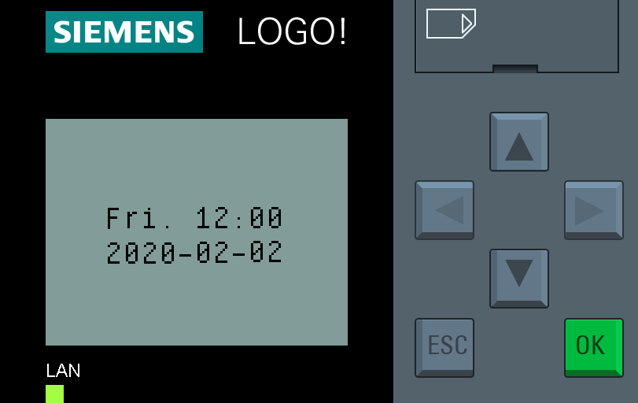
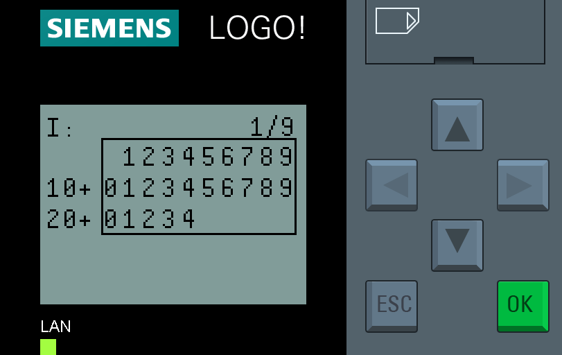
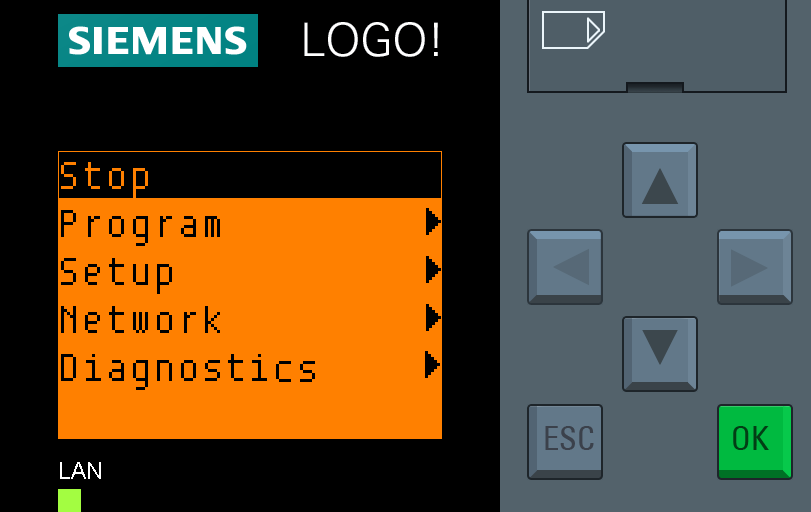
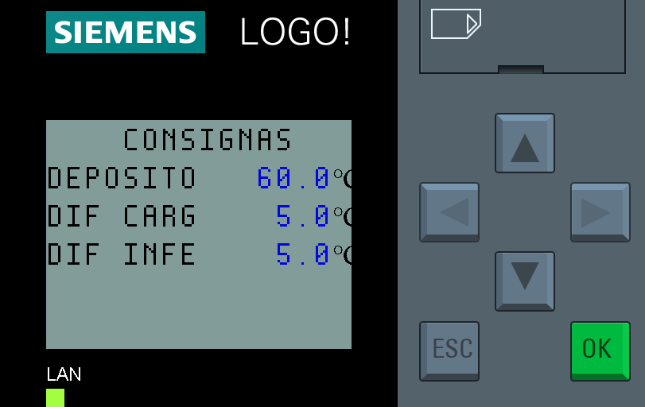
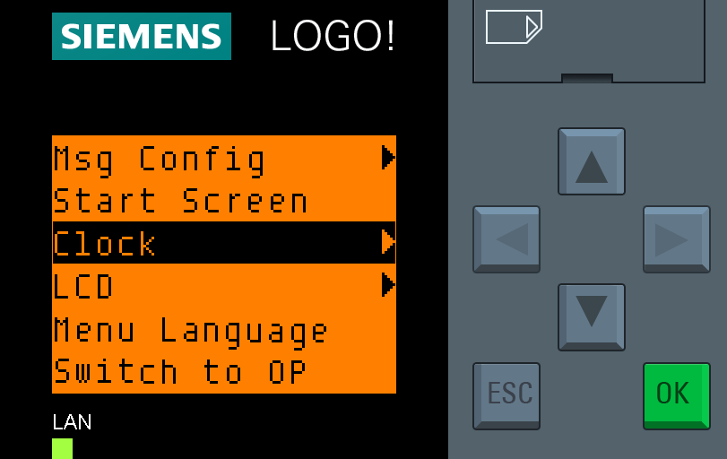
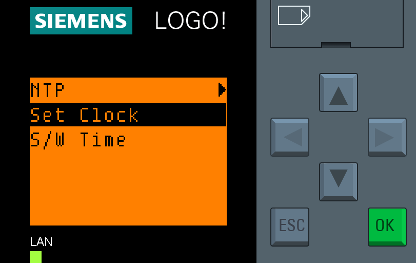
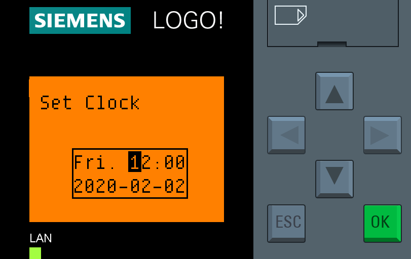

# Manual de Uso de la Pantalla del Logo! 8 de Siemens

## Introducción

El PLC Logo! 8 de Siemens es un controlador lógico programable compacto y versátil que se utiliza en diversas aplicaciones de automatización. Este manual describe cómo utilizar la pantalla integrada del PLC para configurar y monitorear el dispositivo.

## Contenidos

1. [Navegación Básica en la Pantalla](#1-navegación-básica-en-la-pantalla)
2. [Ajuste de Consignas y Horarios](#2-ajuste-de-consignas-y-horarios)
3. [Alarmas](#3-alarmas)
4. [Configuración del Sistema](#4-configuración-del-sistema)

## 1. Navegación Básica en la Pantalla

### 1.1 Botones de Navegación

- **Flechas**: Utilice las flechas arriba, abajo, izquierda y derecha para navegar por las opciones del menú.
- **Enter (OK)**: Selecciona la opción resaltada.
- **Escape (ESC)**: Regresa al menú anterior o cancela la operación actual.

### 1.2 Pantallas ARC

1. Si su aplicación ha sido programada por ARC, puede desplazarse por diferentes pantallas informativas utilizando las flechas direccionales arriba y abajo.

2. El orden en el que se mostrarán las pantallas es el siguiente:
    - Entradas
    - Salidas
    - Consignas
    - Otros parámetros
    - Horarios
    - Programa en RUN

3. La última pantalla "Programa en RUN" es generada por el sistema. Desplazando con las teclas derecha e izquierda se puede mostrar:
    - La hora y la fecha actual (1 pantalla)  
      

    - Estado de entradas, salidas y marcas, analógicas y digitales (9 pantallas)  
      

4. Desde la pantalla "Programa en RUN" se puede acceder al menú principal pulsando la tecla **ESC**  
   

## 2. Ajuste de Consignas y Horarios

### 2.1 Ajuste de Consignas

1. Situarse en la pantalla donde se encuentra el valor que se desea modificar.  
2. Hay pantallas que solo tienen valores de lectura como la de salidas:  
   

3. En caso de la pantalla de, por ejemplo, consignas, los valores marcados aquí en azul (en la pantalla no se ve en colores) sí son modificables.  
   

4. Mantener el **ESC** pulsado para entrar en **modo modificación** hasta que se resalte uno de los valores modificables.  
5. Con las flechas arriba y abajo seleccionar cuál de los valores se quiere modificar.  
6. Una vez seleccionado, presionar **OK** para entrar a modificar el valor.
7. Con las flechas izquierda y derecha desplazarse dígito a dígito y modificar cada dígito con las flechas arriba y abajo.
8. Una vez terminado de modificar, presionar **OK** para aceptar el valor o **ESC** para cancelar.
9. Por último, salir del modo modificación presionando brevemente **ESC**.

### 2.2 Ajuste de Horarios

1. Situarse en la pantalla donde se encuentra el horario que se desea modificar.  
2. Cada horario dispone de dos periodos semanales con un arranque y un paro:  
   

3. La primera línea indica los días que el horario está activo de lunes a domingo con la inicial del día en inglés si está activo, o un guion si no está activo.
4. La segunda y tercera líneas indican la hora de arranque (1) y de parada (0).
5. La última línea puede tener un selector para mantener el horario activado 24 horas independientemente de la programación.
6. El proceso para el ajuste es el mismo que en el ajuste de consignas: 
    - Entrar en **modo modificación** manteniendo **ESC**.
    - Seleccionar el valor a modificar.
    - ...

## 3. Alarmas

### 3.1 Mensajes de alarma

1. En caso de producirse una alarma, aparecerá una nueva pantalla con la información de la alarma y la fecha y la hora en que se ha producido.
2. Con las flechas de dirección arriba y abajo podremos seguir navegando a las pantallas normales.
3. Las pantallas con la información de la alarma serán las primeras en el orden de pantallas mencionado anteriormente.

### 3.2 Reset de alarma

1. En caso de que la alarma haya sido solventada, y en caso de no desaparecer sola, la propia pantalla de alarma dispondrá de un parámetro llamado reset con valor **off**.
2. Siguiendo el mismo procedimiento que en el ajuste de consignas, hay que entrar en **modo modificación** y cambiar el valor de reset a **on**.
3. El valor de reset volverá automáticamente a **off**.
4. Si la alarma se ha corregido, la pantalla de alarma desaparecerá.

## 4. Configuración del Sistema

### 4.1 Menú Principal

Para acceder al menú principal hay que situarse en la "Pantalla principal estándar" y presionar **ESC**. Se mostrará el menú principal:

El menú principal incluye las siguientes opciones:
- Start / Stop: iniciar o parar la ejecución del programa.
- Program: modificar la lógica del programa.
- Setup: ajuste de parámetros avanzados.
- Network: ajuste de la conexión TCP/IP.
- Diagnostics: herramientas de diagnóstico.

### 4.2 Ajuste de Fecha y Hora

1. En el menú principal, seleccione "Setup" y presione **Enter**.  
   

2. Seleccione "Clock" y presione **Enter**.  
   

3. Seleccione "Set Clock" y presione **Enter**.  
   

4. Use las flechas para ajustar la fecha y la hora, y presione **Enter** para confirmar.  
   

### 4.3 Consultar Dirección de Red

1. Desde el menú principal, seleccione "Network" y presione **Enter**.
2. Se abrirá un menú en el que solo está la opción "IP Address". Presione **Enter**.
3. Se abrirá una ventana en la que se puede ver la dirección IP configurada, la máscara de subred y la puerta de enlace.
4. No es posible modificar la dirección IP mientras el programa está corriendo. Si necesita cambiar la dirección IP, previamente en el menú principal tendrá que parar el programa. **TENGA CUIDADO**: el apagado del programa detiene instantáneamente todos los elementos controlados por el equipo sin ninguna secuencia de apagado ni temporizaciones.

### 4.4 Otros ajustes (Avanzado)

Hay muchos más ajustes que se pueden hacer: modificar el programa, gestionar copias e históricos de la tarjeta de memoria, entre otros.

Para más información sobre dichos ajustes, consulte el [manual completo del Logo!](https://support.industry.siemens.com/cs/document/109826499/logo!?dti=0&lc=es-ES).
